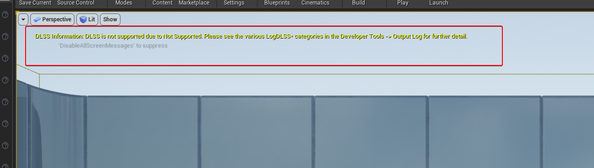
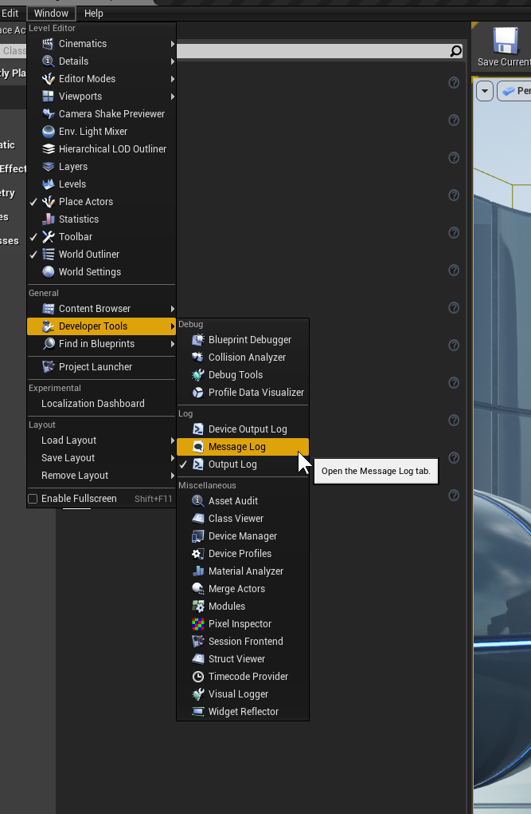
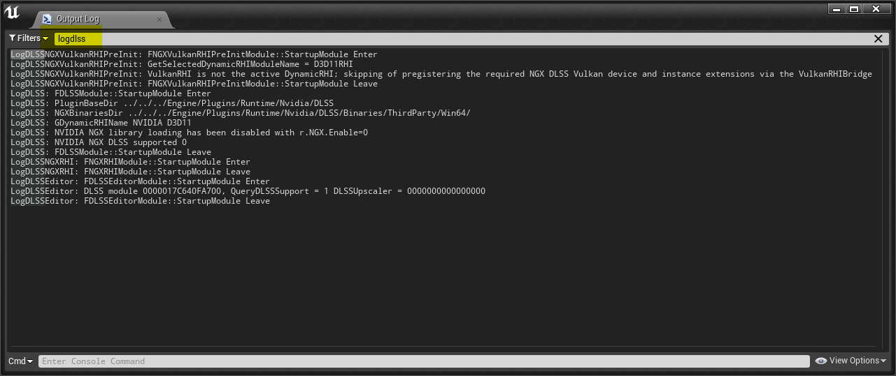
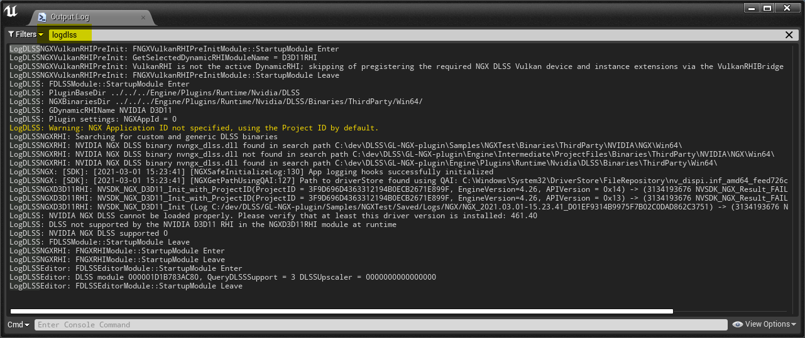
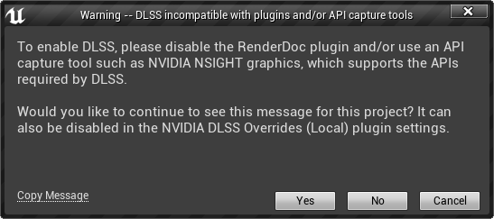
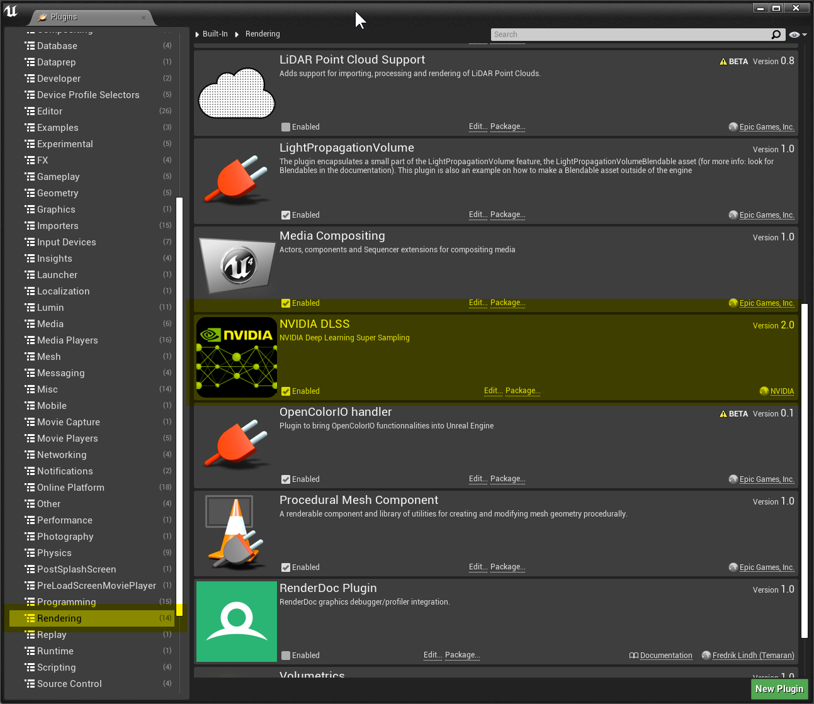
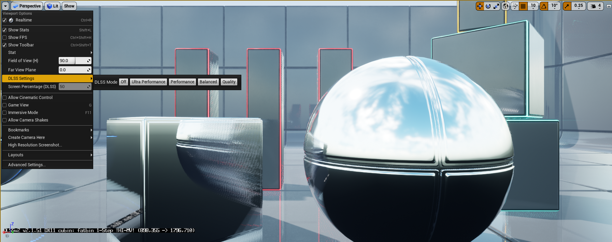
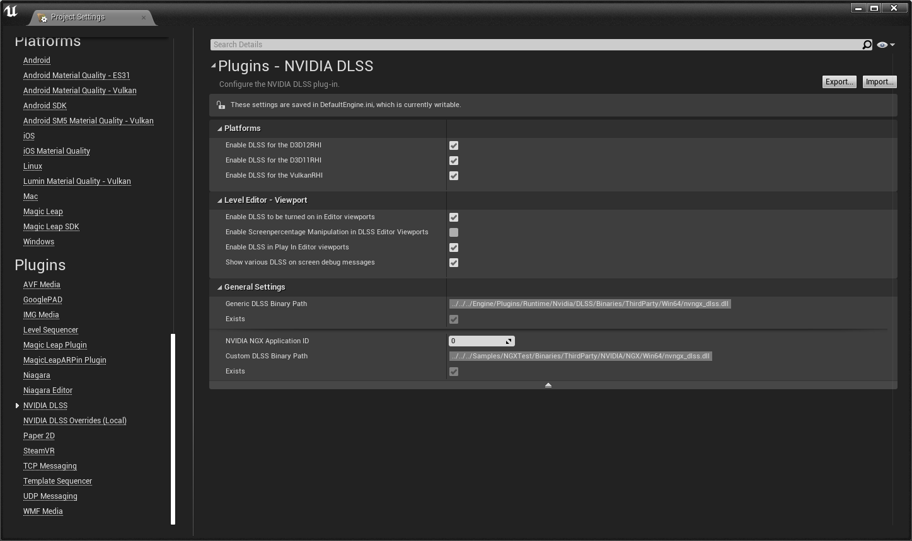
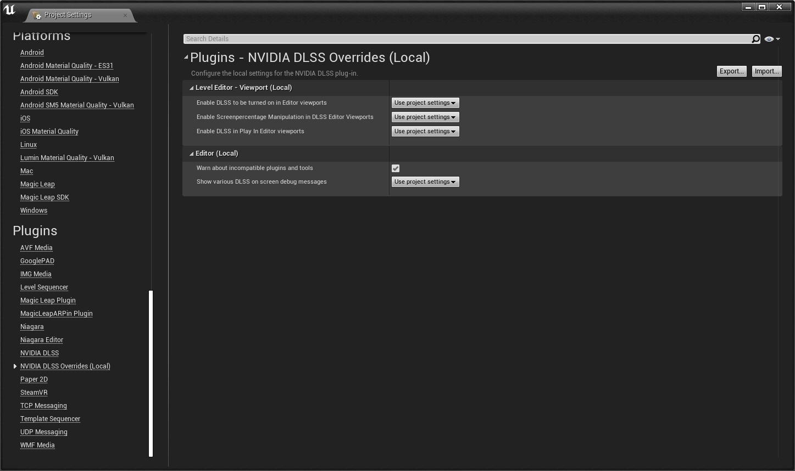
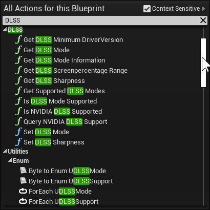

NVIDIA Unreal Engine DLSS Plugin
================================

# Quickstart

Please see below for additional details

1. Enable DLSS plugin in the Editor, then restart the editor
3. DLSS in the Editor: enable the following settings in the Project Plugin settings
   1. Enable DLSS to be turned on in Editor viewports (it should be set by default)
   2. In the Viewport Options (downwards pointing arrow in the top left corner), use the DLSS Settings menu to toggle the different DLSS quality modes
4. DLSS in Game: make sure that the following cvars are set
   1. r.NGX.Enable 1 (can be overriden on the command line with -ngxenable)
   2. r.NGX.DLSS.Enable 1
   3. r.NGX.DLSS.Quality -1
5. DLSS in Blueprint:
   The `SetDLSSMode` function of the DLSS blueprint library provides convenient functions for setting those console variables 
6. Check the log for `LogDLSS: NVIDIA NGX DLSS supported 1`
7. (Optionally) Enable the DLSS on screen indicator in the bottom left of the screen via `\DLSS\Source\ThirdParty\NGX\Utils\ngx_driver_onscreenindicator.reg` to verify that DLSS is active

# Troubleshooting

## System requirements

- Windows 10, 64 bit
  - at least version v1709, Windows 10 Fall 2017 Creators Update 64-bit.
- NVIDIA Geforce Driver
  - Recommended: version 461.40 or higher
  - Required: version 445.00 or higher
- NVIDIA RTX GPU (GeForce, Titan or Quadro) with [DLSS](https://www.nvidia.com/en-us/geforce/technologies/dlss/) support
- UE4 project using either
  - Vulkan
  - DX11
  - DX12

## Diagnosing DLSS Issues in the Editor

The DLSS plugin shows various common reasons why DLSS might not be working at the top of the screen (in non-Shipping build configurations). This message can also be turned off in the DLSS plugin settings, as discussed in the "DLSS Plugin Settings" section in this document.

Additionally, the DLSS plugin modules write various information into the following UE log categories:

* LogDLSS
* LogDLSSEditor
* LogDLSSBlueprint
* LogDLSSNGXRHI
* LogDLSSNGXD3D11RHI
* LogDLSSNGXD3D12RHI
* LogDLSSNGXVulkanRHIPreInit
* LogDLSSNGXVulkanRHI
* LogDLSSNGX

Those can be accessed in the Editor under `Window -> Developer Tools -> Message Log`

The Message log then can be filtered to show only the DLSS related messages to get more information on why DLSS might not be functioning as expected, as shown in those examples.

## Incompatibilities with API Capture Tools such as RenderDoc

The Editor will show a warning at startup if DLSS incompatible API capture tools (such as RenderDoc) or plugins are used. To enable DLSS, please use an API capture tool such as [NVIDIA NSIGHT Graphics](https://developer.nvidia.com/nsight-graphics), which support the NGX APIs required by DLSS.

## Verify Engine side plugin hooks

The following cvars should be set to those values by default:
- r.DefaultFeature.Antialiasing 2
- r.TemporalAA.Upscaler 1
- r.Reflections.Denoiser 2

## Enabling NGX DLSS Logging on End User machines

The DLSS plugin also pipes the NGX DLSS logs into the UE4 logging system into the `LogDLSSNGX` log category. It is enabled by default and can be tweaked with the `r.NGX.LogLevel` and `r.NGX.EnabletherLoggingSinks` console variables

This requires an NVIDIA GeForce **driver version 461.36** or later.

## Enabling NGX DLSS Logging during Development

If r.NGX.EnableOtherLoggingSinks is set then additional NGX logging sinks of the NVIDIA NGX software stack can be used as well, as discussed in the "NGX logging" chapter of the [DLSS Programming Guide](DLSS_Programming_Guide_Release.pdf) for details
The DLSS SDK provides registry keys which can be set with the following .reg files which can be found in the plugin folder under `\DLSS\Source\ThirdParty\NGX\Utils\`:
* `ngx_log_on.reg`
* `ngx_log_off.reg`
* `ngx_log_verbose.reg`

The DLSS plugin will write those into subfolder under `$(ProjectDir)\Saved\Logs\` with a `NGX_$(TimeStamp)_$(GUID)` pattern 
* `nvngx.log`
* `nvngx_dlss_2_1_34.log`
* `nvsdk_ngx.log`

## DLSS On-Screen Indicator

The DLSS SDK provides registry keys which can be set with the following .reg files which can be found in the plugin folder under `\DLSS\Source\ThirdParty\NGX\Utils\`:

* `ngx_driver_onscreenindicator.reg`
* `ngx_driver_off_screenindicator.reg`

With the first registry key set, DLSS will display an indicator on-screen when it is enabled, enabling easier troubleshooting. The second registry key can be used to disable this indicator again.

Please see the [DLSS Programming Guide](DLSS_Programming_Guide_Release.pdf) for further details.

# Command Line Options And Console Variables and Commands

## Enabling DLSS (Engine Side)

The DLSS plugin uses various engine side hooks, which can be configured by the following cvars. Their default values

- r.DefaultFeature.Antialiasing (2, default)
  - Enable Temporal Anti-Aliasing
- r.TemporalAA.Upscaler (1, default)
  - Enable a custom TAAU upscaling plugin, such as the DLSS plugin
- r.Reflections.Denoiser (2, default)
  - Enable a custom denoising pluging. The DLSS plugin makes use of this to improve image quality for raytraced reflections by adding additionial TAA passes
  
## Enabling Motion vectors for DLSS
  
DLSS requires correct motion vectors to function properly. The following console variable can be used to render motion vectors for all objects, and not just the ones with dynamic geometry. This can be useful if it's infeasible to e.g. change all meshes to stationary or dynamic.

- r.BasePassForceOutputsVelocity (0, default)
  - Force the base pass to compute motion vector, regardless of FPrimitiveUniformShaderParameters.
  - 0: Disabled
  - 1: Enabled

## Enabling DLSS (Plugin Side)

- r.NGX.Enable (1, default) can also be overriden on the command line with **-ngxenable** and **-ngxdisable**
  - Whether the NGX library should be loaded. This allow to have the DLSS plugin enabled but avoiding potential incompatibilities by skipping the driver side NGX parts of DLSS.
- r.NGX.DLSS.Enable (1, default)
  - Enable/Disable DLSS entirely.
- r.NGX.DLSS.Quality (-1, default)
  - DLSS Performance/Quality setting. **Note:** Not all modes might be supported at runtime, in this case Balanced mode is used
  - -2: Ultra Performance
  - -1: Performance (default)
  - 0: Balanced
  - 1: Quality
  - 2: Ultra Quality

**Blueprint** functions:
- `SetDLSSMode`, `GetDLSSMode`
- `IsDLSSSupported`, `QueryDLSSSupport`, `GetDLSSMinimumDriverVersion`
- `IsDLSSModeSupported`, `GetSupportedDLSSModes`,`GetDLSSModeInformation`, `GetDLSSScreenPercentageRange`

## DLSS Runtime Image Quality Tweaks

- r.NGX.DLSS.DilateMotionVectors (1, default)
  - 0: pass low resolution motion vectors into DLSS
  - 1: pass dilated high resolution motion vectors into DLSS. This can help with improving image quality of thin details.

- r.NGX.DLSS.Reflections.TemporalAA (1, default)
  - Apply a temporal AA pass on the denoised reflections

- r.NGX.DLSS.WaterReflections.TemporalAA (1, default)
  - Apply a temporal AA pass on the denoised water reflections

- r.NGX.DLSS.Sharpness (0.0f off, default)
  - 0.0 to 1.0: Sharpening to apply to the DLSS pass.
 
**Blueprint** functions: 
- `SetDLSSSharpness`, `GetDLSSSharpness`

## DLSS Binaries

- r.NGX.BinarySearchOrder (0, default)
  - 0: automatic
    - use custom binaries from project and launch folder $(ProjectDir)/Binaries/ThirdParty/NVIDIA/NGX/$(Platform) if present
    - fallback to generic binaries from plugin folder
  - 1: force generic binaries from plugin folder, fail if not found
  - 2: force custom binaries from project or launch folder, fail if not found

## DLSS memory usage

- `stat DLSS`
   - shows how much GPU memory DLSS uses and how many DLSS features, i.e. instances of DLSS are allocated. 
   - In steady state there should be 1 DLSS feature allocated per view. This value can increase temporarily, typically after changing the DLSS quality mode or resizing the window. This can be configured with the `r.NGX.FramesUntilFeatureDestruction` console variable

## NGX Project ID

The DLSS plugin by default uses the project identifier to initialize NGX and DLSS. On rare occasion, NVIDIA might provide a special NVIDIA NGX application ID. The following console variable determines which one is used.

r.NGX.ProjectIdentifier
  - 0: automatic: (default)
    - use NVIDIA NGX Application ID if non-zero, otherwise use UE4 Project ID
  - 1: force UE4 Project ID
  - 2: force NVIDIA NGX Application ID (set via the Project Settings -> NVIDIA DLSS plugin)

Please refer to the "Distributing DLSS" section for further details.

## Miscellaneous

- r.NGX.DLSS.AutomationTesting (0, default)
  - Whether the NGX library should be loaded when GIsAutomationTesting is true.(default is false)
  - Must be set to true before startup. This can be enabled for cases where running automation testing with DLSS desired
- r.NGX.Automation.Enable (0, default)
  - Enable automation for NGX DLSS image quality and performance evaluation.
- r.NGX.Automation.ViewIndex (0, default)
  - Select which view to use with NGX DLSS image quality and performance automation.
- r.NGX.Automation.NonGameViews (0,default)
  - Enable non-game views for NGX DLSS image quality and performance automation. 
- r.NGX.FramesUntilFeatureDestruction (3, default)
  - Number of frames until an unused NGX feature gets destroyed
- r.NGX.DLSS.MinimumWindowsBuildVersion (16299, default for v1709)
  - Sets the minimum Windows 10 build version required to enable DLSS
- r.NGX.LogLevel (1, default)
  - Determines the minimal amount of logging the NGX implementation. Please refer to the DLSS plugin documentation on other ways to change the logging level.
   - 0: off
   - 1: on 
   - 2: verbose
- r.NGX.DisableOtherLoggingSinks (0, default)
  - Determines whether the NGX implementation will turn off additional log sinks LogDLSSNGXRHI
  - 0: off
  - 1: on

# DLSS in the Editor

## Enabling DLSS for a project 

## Enabling DLSS in Level Editor Viewports

With "Enable DLSS to be turned on in Editor viewports" set in the project plugin settings, (on by default), the DLSS mode can be turned on in level editor viewports like this. Each viewport can have a different DLSS mode.

## DLSS Plugin Settings

Some of the "Level Editor - Viewport" settings are split across two config files and settings pages to tailor how DLSS is interacting with the editor user experience. 

For example, a cross-platform game project might find it more practical by default to only have DLSS enabled in "Play In Editor Viewports" or in "game mode" in order to maintain a consistent content authoring experience across the range of supported platforms.
However projects (e.g. an architecture visualization project with notable raytracing workloads), might find it more useful to have DLSS enabled during the content authoring. Either way each user can override those settings locally:

- `Project Settings -> Plugins -> NVIDIA DLSS`
  - stored in DefaultEngine.ini
  - typically resides in source control. 
  - settings here are shared between users 
- `Project Settings -> Plugins -> NVIDIA DLSS (Local)`
  - stored UserEngine.ini
  - not recommended to be checked into source control. 
  - allow a user to override project wide settings if desired. Defaults to "use project settings"

## DLSS Blueprints

The UDLSSLibrary blueprint library provides functionality to query whether DLSS and which modes are supported. It also provides convenient functions to enable the underlying DLSS console variables. The tooltips of each function provide additional information.

Using the UDLSSLibrary via blueprint or C++ (by including the DLSSBlueprint module in a game project) is recommended over setting the console variables directly. This will make sure that any future updates will be picked up by simply updating the DLSS plugin, without having to update the game logic.

# Distributing DLSS

The DLSS plugin ships with a ready-to-use production DLSS binary (without watermarks) and uses the project identifier to initialize NGX and DLSS. This is the common case for distribution to end users and does not require further actions from either your or NVIDIA's side.
On rare occasion NVIDIA however might provide:

1. a custom project specific DLSS binary
2. an NVIDIA application ID

In that case those can be configured in the advanced plugin settings. Additionally please also ensure that the r.NGX.ProjectIdentifier console variable is set to either 0 (the default) or 2.
The project plugin settings can be used to configure those (please see above).

1. The custom, project specific DLSS binary `nvngx_dlss.dll` should be put into the project under `$(ProjectDir)/Binaries/ThirdParty/NVIDIA/NGX/$(Platform)`
2. Setting the NVIDIA NGX application ID for the project.
  

Please refer to "Chapter 4 Distributing DLSS in a Game" in the the [DLSS Programming Guide](DLSS_Programming_Guide_Release.pdf) for details.

# DLSS API and UI Documentation

The [DLSS Programming Guide](DLSS_Programming_Guide_Release.pdf) provides details about the NVIDIA NGX APIs which are used by the plugin to implement DLSS.

The [RTX Developer Guidelines](RTX_Developer_Guidelines.pdf) ([Chinese](RTX_Developer_Guidelines_Chinese_Version.pdf)) provide details about recommended game settings and UI for DLSS.
